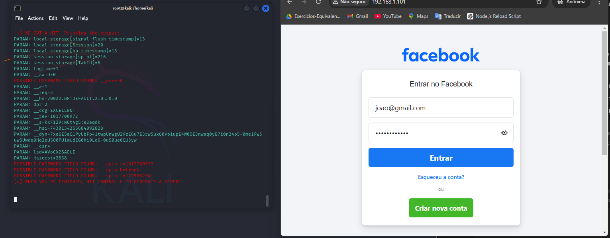

# Phishing para captura de senhas

### Configurando o Phishing no Kali Linux

utilizando o terminal:
- Iniciando o setoolkit: ``` setoolkit ```
- Tipo de ataque: ``` Social-Engineering Attacks ```
- Vetor de ataque: ``` Web Site Attack Vectors ```
- Método de ataque: ```Credential Harvester Attack Method ```
- Método de ataque: ``` Site Cloner ```
- URL para clone: http://www.facebook.com

### Resutados


